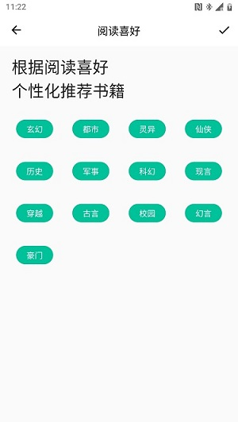
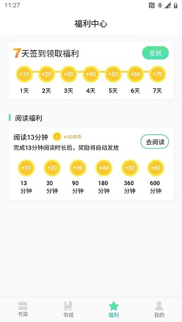
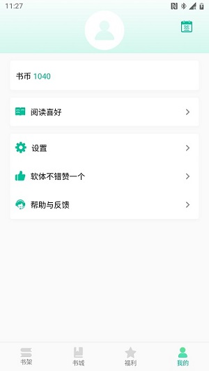

# novel-fpg

## 1、项目介绍

> novel-fpg是一个小说开源项目，前端基于Flutter，后端是Python + Go双端（各自基于Flask、Gin实现了一遍），包含了用户注册、登录、jwt鉴权、签到、任务、书架、阅读器、购买章节、搜索书籍、绑定第三方账号、设置等功能。
 该项目旨在快速搭建中小型App项目，如果只追求开发效率，对并发性能没有要求建议使用Python进行后端开发，否则采用Go（该项目在实现同样功能的情况下，Go的代码量是Python的两倍）；后端API为了方便，只注册了一个接口路由，接口函数通过请求参数动态执行。
 为了提高获取小说内容的效率，小说章节目录及内容均已上传到COS存储桶，前端以加载并解密文件的方式获取，如果是线上项目可以配置CDN加速。
 项目管理后台（集成BI系统）是通过Vue和Python前后端分离的方式开发，本仓库暂未提交，后续陆续开放。
 该项目还用到了一些RPA工具，例如小说的自动采集、同步（可通过后台配置采集目标、采集模板、采集频率等），后续再整理上传源码。

Android 安装包[下载地址](https://github.com/black-currant/novel-fpg/raw/main/novel-flutter/app-release.apk)

## 2、效果图

## 3、主要功能

- 用户注册：新注册用户发放1000书币
- 登录：未注册用户登录会先自动注册
- jwt鉴权：登陆、注册以外的接口请求头需要带上jwt生成的token，以进行合法性检验及解析用户ID
- 签到：每日签到获取书币奖励
- 任务：任务有每日任务，每周任务，日环任务等类型
- 书架：收藏书籍
- 阅读器：设置字体、行距、背景颜色、夜间模式等
- 购买章节：默认章节都是免费，管理后台可进行收费章节设置
- 搜索书籍：获取书籍列表接口均通过组合条件查询ElasticSearch，并将结果缓存到redis，保存两小时
- 绑定第三方账号：绑定微信、Facebook、Google等第三方平台
- 设置：设置阅读偏好等

## 4、技术选型

- 前端：基于Flutter实现，[传送入口](novel-flutter/README.md)
- Python后端：基于Python + Flask实现，[传送入口](novel-python/README.md)
- Go后端：基于Go + Gin实现，[传送入口](novel-go/README.md)

## 5、联系方式

| 微信 |
|  :---:  | 
| 

## 6. 捐赠

如果你觉得这个项目对你有帮助，你可以请作者喝茶
| 支付宝 |
|  :---:  | 
| 